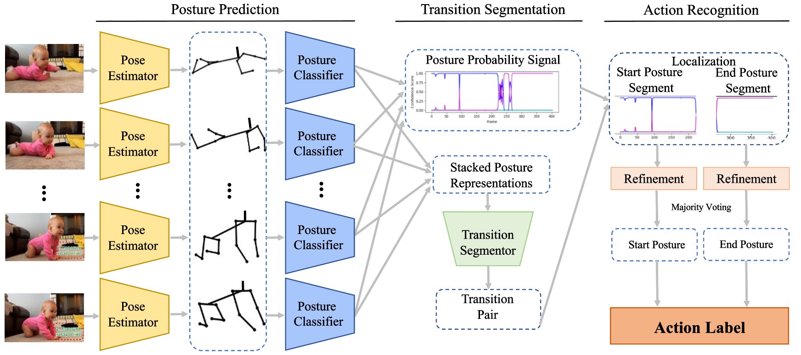
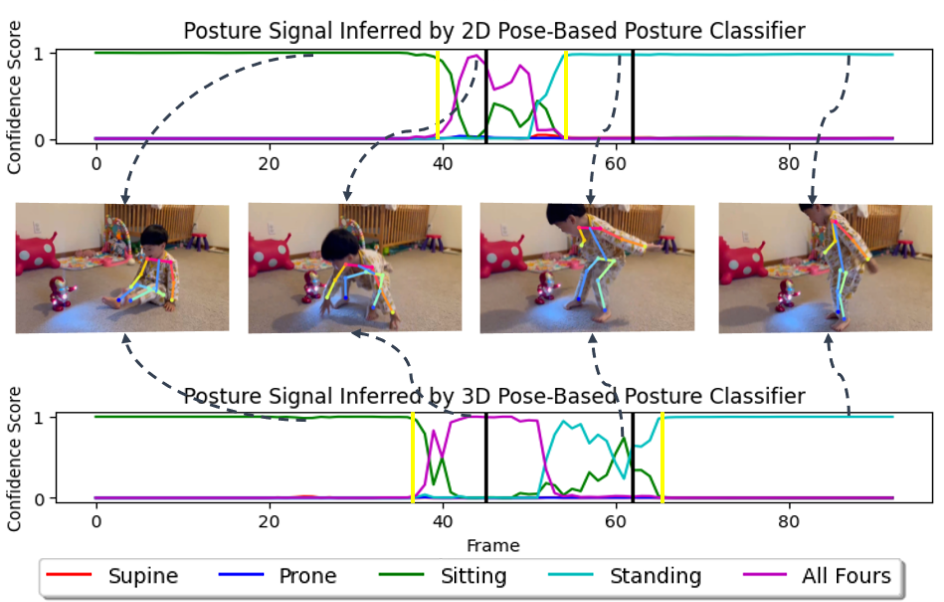

# Posture-based Infant Action Recognition

This is the official code repository for our paper:

Huang X, Luan L, Hatamimajoumerd E, Wan M, Daneshvar KP, Obeid R, Ostadabbas S. Posture-based Infant Action Recognition in the Wild with Very Limited Data. *CVPR Workshop on Learning with Limited Labelled Data for Image and Video Understanding, 2023*.


Contact: [Xiaofei Huang](xhuang@ece.neu.edu), [Sarah Ostadabbas](ostadabbas@ece.neu.edu)


### Table of contents
1. [Introduction](#introduction)
2. [InfAct Dataset](#infact)
3. [Environment](#environment)
4. [Instructions](#instructions)
5. [Citation](#citation)
6. [Acknowledgment](#acknowledgement)
7. [License](#license)

## Introduction
<a name="introduction"></a>
In this work, we present a data-efficient pipeline for infant action recognition (illustrated below), based on the idea of modeling an action as a time sequence consisting of two different stable postures with a transition period between them. The postures are detected frame-wise from the estimated 2D and 3D infant body poses and the action sequence is segmented based on the posture-driven low-dimensional features of each frame.

To spur further research in the field, we also created and release the first-of-its-kind infant action dataset—InfAct—consisting of 200 fully annotated home videos representing a wide range of common infant actions, intended as a public benchmark.



## InfAct Dataset
[InfAct](https://coe.northeastern.edu/Research/AClab/InfAct/InfAct.zip)
Because of the copyright of Youtube videos, we only can provide the video links and annotations here. Please download them and process them to reconstruct our InfAct dataset. 


## Environment
<a name="environment"></a>
The code was developed using Python 3.7 on Ubuntu 18.04.

Please install dependencies:
   ```
   pip install -r requirements.txt
   ```

Clone this repo into a directory, which we will call ``${Action_ROOT}``. Then create subdirectories as needed to obtain the following structure.
   ```
   ${Action_ROOT}
   ├── action_res
   ├── custom_syrip
   ├── frame_data
   ├── images
   ├── pose_2d_res
   ├── pose_3d_res
   ├── posture_2d_res
   ├── posture_3d_res
   ├── seg_2d_res
   ├── seg_3d_res
   ├── TransitionSegmentor
   ├── utils
   ├── videos_npz
   ├── requirements.txt
   ├── action_inference.py
   └── readme.md

   ```

## Instructions
<a name="instructions"></a>
### Data Preparation
Convert infant action videos into frame sets saved in the subfolder `frame_data` with the following structure. You can also download and use our [InfAct](#infact) dataset for testing.
   ```
   ├──frame_data
   |    ├── vid_1
   |    |       ├── frame0000.jpg
   |    |       ├── frame0001.jpg
   |    |       :
   |    |       :
   |    |       └── frame0303.jpg
   :    ├── vid_2
   :    :  
   ```  
### Stage 1: Infant Detection
Use [YOLOv6](https://github.com/meituan/YOLOv6) to detect infant body in each frame (for subsequent 2D/3D pose estimation), and save the detected bounding box output in the subdirectory `bbox_data` with the following structure:
   ```
   ├──bbox_data
   |    ├── vid_1
   |    |       ├── frame0000.txt
   |    |       ├── frame0001.jpg
   |    |       :
   |    |       :
   |    |       ├── frame0303.txt
   |    |       └── frame0303.jpg
   :    ├── vid_2
   :    :  
   ```   
### Stage 2: Infant 2D/3D Pose Estimation
For 2D keypoints prediction, apply the [FiDIP model](https://arxiv.org/abs/2010.06100) to estimate infant 2D pose from each frame, and then save the inferred 2D poses in the `pose_2d_res` subdirectory:  
   ```
   ├──pose_2d_res
   |    ├── vid_1
   |    |       └── keypoints_validate_infant_results_0.json
   |    ├── vid_2
   :    |       └── keypoints_validate_infant_results_0.json
   :    : 
   ```   
For 3D keypoints prediction, use [HW-HuP mdoel for infant](https://arxiv.org/abs/2105.10996) to estimate infant 3D pose and camera parameters from each frame, and then save the inferred 3D poses  in the `pose_3d_res` subdirectory:
   ```
   ├──pose_3d_res
   |    ├── vid_1
   |    |       ├── output_pose_3D.npy
   |    |       ├── output_imgnames.npy
   |    |       ├── output_gt_3D.npy
   |    |       └── eval_rst.npz
   :    ├── vid_2
   :    :  
   ```   
### Stage 3: Infant 2D/3D Pose-based Posture Classification
Use our retrained 2D/3D pose-based posture classification model ([model download](https://drive.google.com/drive/folders/1X_d_Rle9aDeyCNECaH8Wu1N2IHdF9gAJ?usp=share_link)) to infer the posture class of each frame, and save results as follows: 
   ```
   ├──posture_2d_res/posture_3d_res
   |    ├── vid_1
   |    |       ├── tar.npy
   |    |       ├── score.npy
   |    |       ├── pred.npy
   |    |       └── feat.npz
   :    ├── vid_2
   :    :  
   ```   
### Stage 4: Transition Segmentation
Run `TransitionSegmentor/inference.py` to find the first start frame and last end frame of transition state in the video. Please download the [segmentation models](https://drive.google.com/drive/folders/1ZuwZ8sqY5w-27N3EcWqtPamztP00diCz?usp=share_link) and place them in `TransitionSegmentor/final_models`.
The pair of frame indices for each video is saved in subfolder:
   ```
   ├──seg_2d_res/seg_3d_res
   |    ├── vid_1
   |    |       └── segment_result.txt
   |    ├── vid_2
   :    |       └── segment_result.txt
   :    : 
   ```   

### Stage 5: Infant Action Recognition  
Run `action_inference.py` to output the final action label, which is a pair of start posture and end psoture. The pair of frame indices for each video is saved in subfolder:
   ```
   ├──action_res
   |    ├── vid_1
   |    |       ├── 2d_based_action_result.txt
   |    |       └── 3d_based_action_result.txt
   |    ├── vid_2
   |    |       ├── 2d_based_action_result.txt
   :    |       └── 3d_based_action_result.txt
   :    :
   ```   

## Citation
<a name="citation"></a>

If you use our code or models in your research, please cite with:
```
@inproceedings{huang2023infAct,
  title={{Posture-based Infant Action Recognition in the Wild with Very Limited Data}},
  author={Huang, Xiaofei and  Luan, Lingfei  and  Hatamimajoumerd, Elaheh   and  Wan, Michael and  DaneshvarKakhaki, Pooria and Obeid, Rita and Ostadabbas, Sarah},
  booktitle={CVPR Workshop on Learning with Limited Labelled Data (CVPRW)},
  month={6},
  year={2023}
}
```

## Acknowledgement
<a name="acknowledgement"></a>
[Dr.VOT : Measuring Positive and Negative Voice Onset Time in the Wild, Yosi Shrem, Matthew Goldrick, Joseph Keshet](https://github.com/MLSpeech/Dr.VOT)


## License 
<a name="license"></a>
This code is for non-commercial purpose only. 

By downloading or using any of the datasets provided by the ACLab, you are agreeing to the “Non-commercial Purposes” condition. “Non-commercial Purposes” means research, teaching, scientific publication and personal experimentation. Non-commercial Purposes include use of the Dataset to perform benchmarking for purposes of academic or applied research publication. Non-commercial Purposes does not include purposes primarily intended for or directed towards commercial advantage or monetary compensation, or purposes intended for or directed towards litigation, licensing, or enforcement, even in part. These datasets are provided as-is, are experimental in nature, and not intended for use by, with, or for the diagnosis of human subjects for incorporation into a product.

For further inquiry please contact: Augmented Cognition Lab at Northeastern University: [http://www.northeastern.edu/ostadabbas/ 
](http://www.northeastern.edu/ostadabbas/).


